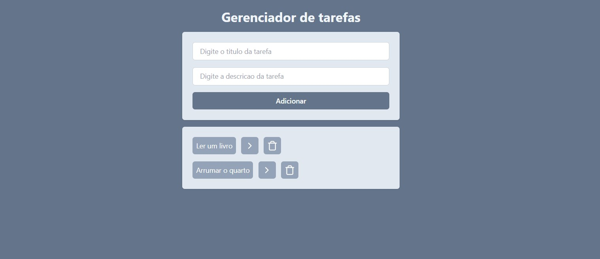
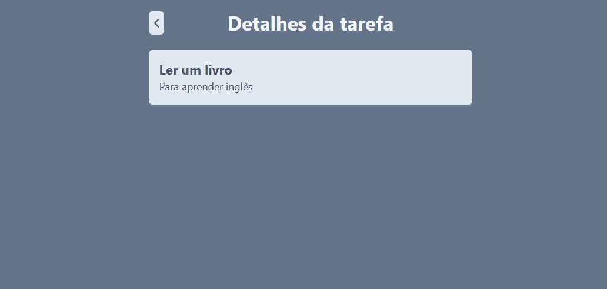

# Gerenciador de Tarefas com React


## Sobre o projeto

Este projeto e um pequeno sistema de gerenciamento de tarefas desenvolvido com React, Vite, React Router e Tailwind CSS.

A aplicacao permite:

- cadastrar tarefas com titulo e descricao;
- marcar tarefas como concluidas;
- remover tarefas da lista;
- visualizar os detalhes de uma tarefa em uma rota separada;
- persistir os dados localmente no navegador com `localStorage`.

O sistema foi estruturado de forma simples e didatica, com foco em componentizacao, gerenciamento de estado com hooks e navegacao entre paginas.

### Tela principal



### Tela de detalhes



## Funcionalidades

### 1. Cadastro de tarefas

O formulario principal recebe:

- titulo da tarefa;
- descricao da tarefa.

Ao clicar em `Adicionar`, a aplicacao valida se os campos foram preenchidos. Se algum campo estiver vazio, exibe um `alert` pedindo o preenchimento completo.

### 2. Listagem de tarefas

As tarefas cadastradas sao renderizadas em uma lista na pagina principal.

Cada item mostra:

- o titulo da tarefa;
- um botao para marcar como concluida;
- um botao para abrir os detalhes;
- um botao para excluir.

### 3. Marcacao de conclusao

Ao clicar sobre a tarefa, o estado `isCompleted` e invertido.

Visualmente, a tarefa concluida recebe a classe `line-through`, deixando o texto riscado.

### 4. Exclusao de tarefas

Cada item possui um botao com icone de lixeira. Ao clicar, a tarefa e removida da lista.

### 5. Pagina de detalhes

Ao clicar no botao de detalhes, o sistema navega para a rota `/task`.

Os dados sao enviados via query string, com os parametros:

- `title`
- `description`

A pagina de detalhes exibe:

- titulo da tarefa;
- descricao da tarefa;
- botao para voltar para a tela anterior.

### 6. Persistencia local

As tarefas sao armazenadas no `localStorage` com a chave `tasks`.

Isso permite que, ao recarregar a pagina, a lista continue disponivel no navegador do usuario.

## Tecnologias utilizadas

- React 18
- Vite 5
- React Router DOM 6
- Tailwind CSS 3
- Lucide React
- UUID
- ESLint
- PostCSS
- Autoprefixer

## Dependencias principais

### `react` e `react-dom`

Responsaveis pela renderizacao da interface e pela estrutura da aplicacao.

### `react-router-dom`

Utilizado para configurar as rotas da aplicacao e a navegacao entre a pagina principal e a pagina de detalhes.

### `lucide-react`

Fornece os icones usados nos botoes de detalhes e exclusao, alem do botao de voltar.

### `uuid`

Usado para gerar identificadores unicos para cada tarefa criada.

## Estrutura do projeto

```text
Curso/
|-- imgs/
|   |-- 1.jpg
|   `-- 2.jpg
|-- public/
|   `-- vite.svg
|-- src/
|   |-- assets/
|   |   `-- react.svg
|   |-- components/
|   |   |-- AddTask.jsx
|   |   |-- Button.jsx
|   |   |-- Input.jsx
|   |   |-- Tasks.jsx
|   |   `-- Title.jsx
|   |-- pages/
|   |   `-- TaskPage.jsx
|   |-- App.jsx
|   |-- App.css
|   |-- index.css
|   `-- main.jsx
|-- dist/
|-- .gitignore
|-- eslint.config.js
|-- index.html
|-- package-lock.json
|-- package.json
|-- postcss.config.js
|-- tailwind.config.js
|-- vite.config.js
`-- README.md
```

## Arquitetura e responsabilidade dos arquivos

### `src/main.jsx`

Ponto de entrada da aplicacao.

Responsabilidades:

- criar o `BrowserRouter` com `createBrowserRouter`;
- registrar as rotas `/` e `/task`;
- renderizar a aplicacao com `RouterProvider` dentro do `StrictMode`.

### `src/App.jsx`

Componente principal da pagina inicial.

Responsabilidades:

- manter o estado global da lista de tarefas com `useState`;
- carregar tarefas do `localStorage` na inicializacao;
- salvar as tarefas no `localStorage` com `useEffect` sempre que houver alteracao;
- adicionar novas tarefas;
- alternar o status de conclusao;
- excluir tarefas;
- compor os componentes `Title`, `AddTask` e `Tasks`.

### `src/components/AddTask.jsx`

Componente do formulario de criacao.

Responsabilidades:

- controlar os campos de titulo e descricao;
- validar o preenchimento antes do envio;
- chamar a funcao `onAddTaskClick` recebida por props;
- limpar os campos apos adicionar uma tarefa.

### `src/components/Tasks.jsx`

Componente responsavel por renderizar a lista de tarefas.

Responsabilidades:

- exibir cada tarefa;
- permitir marcar/desmarcar como concluida;
- navegar para a tela de detalhes;
- acionar a exclusao da tarefa.

### `src/pages/TaskPage.jsx`

Pagina de detalhes da tarefa.

Responsabilidades:

- ler os parametros da URL com `useSearchParams`;
- mostrar titulo e descricao;
- voltar para a tela anterior com `useNavigate(-1)`.

### `src/components/Input.jsx`

Componente reutilizavel para campos de entrada com estilizacao padrao.

### `src/components/Button.jsx`

Componente base para botoes.

Observacao importante: no estado atual do codigo, ele aplica classes fixas e nao reutiliza a prop `className`, mesmo quando ela e enviada por componentes como `Tasks.jsx`. Na pratica, isso limita a personalizacao visual dos botoes.

### `src/components/Title.jsx`

Componente simples para padronizar os titulos das telas.

### `src/index.css`

Arquivo responsavel por importar as camadas do Tailwind CSS:

- `@tailwind base`
- `@tailwind components`
- `@tailwind utilities`

### `src/App.css`

Arquivo herdado do template inicial do Vite. Atualmente nao esta sendo utilizado pela aplicacao, ja que os estilos principais sao aplicados com Tailwind CSS.

## Fluxo da aplicacao

### Inicializacao

1. A aplicacao e montada em `main.jsx`.
2. O roteador define as paginas `/` e `/task`.
3. O componente `App` tenta recuperar as tarefas salvas no `localStorage`.
4. Caso nao existam dados validos, a lista comeca vazia.

### Criacao de tarefa

1. O usuario preenche titulo e descricao.
2. O componente `AddTask` valida os campos.
3. `App.jsx` cria um objeto de tarefa com:
   - `id`
   - `title`
   - `description`
   - `isCompleted`
4. A nova tarefa e adicionada ao estado.
5. O `useEffect` salva a nova lista no `localStorage`.

### Conclusao de tarefa

1. O usuario clica no item da tarefa.
2. O metodo `onTaskClick` percorre a lista com `map`.
3. Quando encontra a tarefa clicada, alterna o valor de `isCompleted`.
4. A interface e atualizada automaticamente.

### Exclusao de tarefa

1. O usuario clica no botao de lixeira.
2. O metodo `onDeleteTaskClick` usa `filter` para remover o item.
3. O estado e atualizado.
4. O `localStorage` tambem e atualizado.

### Visualizacao de detalhes

1. O usuario clica no botao com seta.
2. `Tasks.jsx` cria uma query string com `URLSearchParams`.
3. O navegador vai para `/task?title=...&description=...`.
4. `TaskPage.jsx` le esses parametros e renderiza os dados na tela.

## Modelo de dados

Cada tarefa segue esta estrutura:

```js
{
  id: "uuid-gerado-automaticamente",
  title: "Titulo da tarefa",
  description: "Descricao da tarefa",
  isCompleted: false
}
```

## Persistencia com localStorage

O projeto usa duas etapas importantes para persistencia:

### Leitura inicial

Na inicializacao do estado, o sistema:

- busca `localStorage.getItem("tasks")`;
- tenta converter o valor com `JSON.parse`;
- garante que o resultado seja um array;
- retorna `[]` em caso de erro ou dados invalidos.

### Escrita automatica

Um `useEffect` observa o estado `tasks`.
Sempre que ele muda, o sistema executa:

```js
localStorage.setItem("tasks", JSON.stringify(tasks));
```

## Rotas

### `/`

Tela principal com:

- titulo da aplicacao;
- formulario de cadastro;
- lista de tarefas.

### `/task`

Tela de detalhes da tarefa.

Exemplo de URL:

```text
/task?title=Estudar%20React&description=Revisar%20hooks
```

## Estilizacao

A interface foi estilizada com Tailwind CSS, utilizando classes utilitarias diretamente nos componentes.

Padroes visuais observados:

- fundo principal em tons de `slate`;
- containers com `rounded-md` e `shadow`;
- espacamento com utilitarios como `p-6`, `gap-3` e `space-y-4`;
- tipografia simples e objetiva;
- layout centralizado na tela principal.

## Scripts disponiveis

No `package.json`, os scripts configurados sao:

```bash
npm run dev
npm run build
npm run lint
npm run preview
```

### `npm run dev`

Inicia o servidor de desenvolvimento do Vite.

### `npm run build`

Gera a build de producao na pasta `dist`.

### `npm run lint`

Executa a analise estatica com ESLint.

### `npm run preview`

Sobe um servidor local para visualizar a build gerada.

## Como executar o projeto

### Requisitos

- Node.js instalado
- npm instalado

### Passos

1. Instale as dependencias:

```bash
npm install
```

2. Inicie o ambiente de desenvolvimento:

```bash
npm run dev
```

3. Acesse a URL exibida no terminal, normalmente algo como:

```text
http://localhost:5173
```

## Configuracoes do projeto

### `vite.config.js`

Configura o Vite com o plugin oficial do React.

### `tailwind.config.js`

Define os arquivos que serao analisados pelo Tailwind para gerar as classes utilizadas no projeto.

### `postcss.config.js`

Integra o Tailwind CSS e o Autoprefixer ao processo de build.

### `eslint.config.js`

Configura regras de lint para JavaScript e React, incluindo hooks e refresh.

## Pontos fortes do sistema

- estrutura simples e facil de entender;
- boa separacao entre pagina, componentes e ponto de entrada;
- uso de hooks do React de forma didatica;
- persistencia local sem necessidade de backend;
- navegacao entre telas com React Router;
- componentes reutilizaveis para titulo e input.

## Limitacoes e observacoes tecnicas

- os detalhes da tarefa sao enviados pela URL, e nao por estado global ou identificador da tarefa;
- se a pagina de detalhes for acessada diretamente sem query string, os dados podem aparecer vazios;
- o componente `Button` nao repassa `className`, o que reduz a customizacao visual esperada em `Tasks.jsx`;
- o projeto ainda nao possui testes automatizados;
- nao ha edicao de tarefas;
- nao existe confirmacao antes da exclusao;
- a validacao do formulario usa `alert`, o que funciona, mas pode ser melhorado com mensagens visuais na interface.

## Possiveis melhorias

- permitir editar tarefas existentes;
- adicionar confirmacao antes de excluir;
- corrigir o componente `Button` para aceitar `className` e outras props;
- criar tratamento para rota de detalhes sem parametros;
- substituir query string por busca da tarefa por `id`;
- adicionar testes de componentes e testes de fluxo;
- melhorar a responsividade em telas menores;
- exibir mensagens de erro e sucesso dentro da interface.

## Resumo

Este projeto representa um CRUD simples de tarefas no frontend, com foco em fundamentos de React.

Ele explora conceitos importantes como:

- componentizacao;
- props;
- estado com `useState`;
- efeitos com `useEffect`;
- roteamento com `react-router-dom`;
- persistencia com `localStorage`;
- estilizacao com Tailwind CSS.

Para um projeto pequeno de estudo, a base esta bem organizada e cumpre bem o objetivo de demonstrar o fluxo completo de manipulacao de tarefas no cliente.
